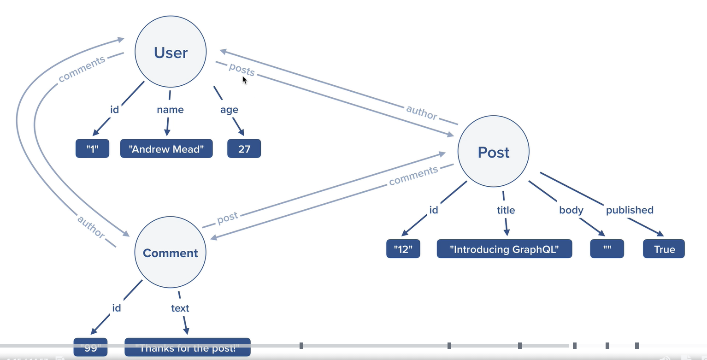

# System Diagram



# Sample GraphQL Queries

```graphql
query {
  greeting(name: "Suresh Kumar", position: "Lead Software Engineer")
  sum(frstNum: 25, secNum: 40)
  me {
    id
    name
    email
    age
  }
  post {
    id
    title
    body
    published
  }
  grades
  add(numbers: [1, 5, 10, 2])

  users(query: "q") {
    id
    name
    age
    email
  }
  posts(pst: "Azure") {
    id
    title
    body
    published
  }
}
```

## Sample 2

```graphql
query {
  GetPosts(pst: "Azure") {
    id
    title
    body
    published
    author {
      id
      name
      email
      age
    }
  }
  GetUsers {
    id
    name
    email
    posts {
      id
      title
      body
    }
  }
}
```

## Sample 3

```graphql
query {
  GetPosts(pst: "Azure") {
    id
    title
    body
    published
    author {
      id
      name
      email
      age
    }
  }
  GetUsers {
    id
    name
    email
    posts {
      id
      title
      body
    }
    comments {
      id
      text
    }
  }
  GetCommets {
    id
    text
    author {
      name
    }
  }
}
```

## Sample 4

```graphql
query {
  GetPosts {
    id
    title
    comments {
      id
      text
    }
  }
}

query {
  GetCommets {
    id
    text
    author {
      name
    }
    post {
      title
    }
  }
}
```

## Sample 5 Mutation

### Create new user

```graphql
mutation {
  createUser(name: "TestUser", email: "testuser@email.com", age: 34) {
    id
    name
    email
    age
  }
}
```

### Create new user by babel-plugin-transform-object-rest-spread (plugin)

```graphql
mutation {
  createUser(
    inputdata: { name: "TestUser", email: "testuser@email.com", age: 34 }
  ) {
    id
    name
    email
    age
  }
}
```

### Delete user with it's posts and comments also

```graphql
mutation {
  deleteUser(id: "1") {
    id
    email
  }
}
```

### update user

```graphql
mutation {
  updateUser(id: "1", data: { name: "SSK", age: null }) {
    id
    email
    name
    age
  }
}
```

## Sample 6 Mutation

```graphql
mutation {
  createPost(
    title: "testTitle"
    body: "testBody"
    published: false
    author: "82cc1ea2-e12b-4718-baf1-196a37352522"
  ) {
    id
    title
    body
    published
    author {
      name
    }
    comments {
      id
      text
    }
  }
}
```

## Sample 7 Mutation

```graphql
mutation {
  createComment(
    text: "you should check out GraphQL"
    author: "2"
    post: "Post2"
  ) {
    id
    text
    author {
      name
    }
    post {
      title
    }
  }
}
```
